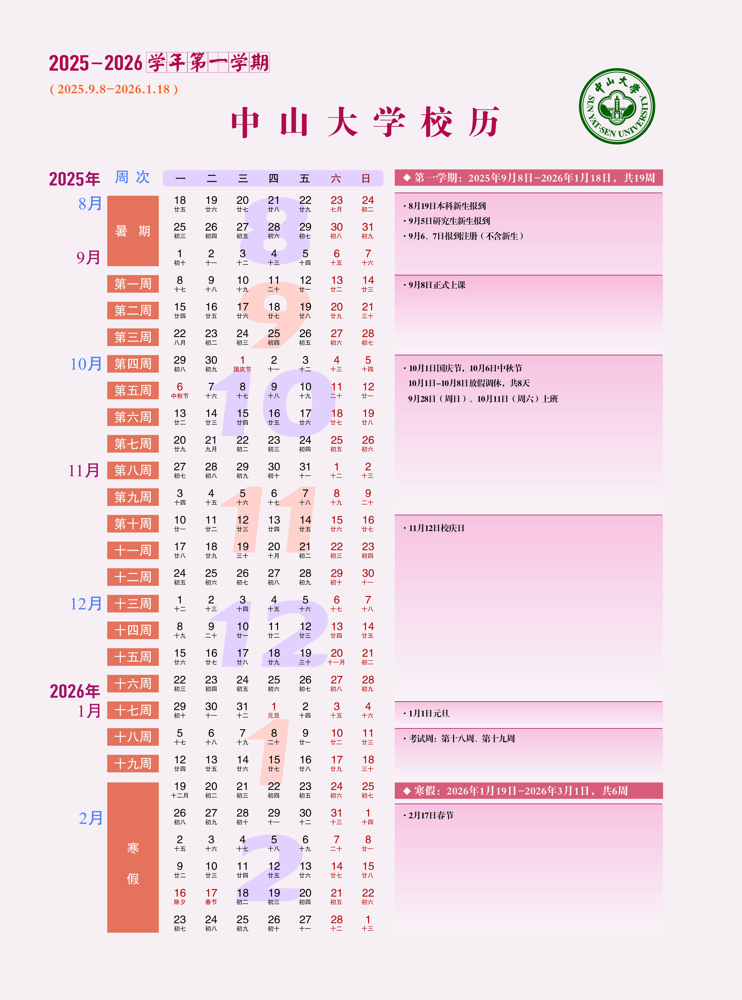
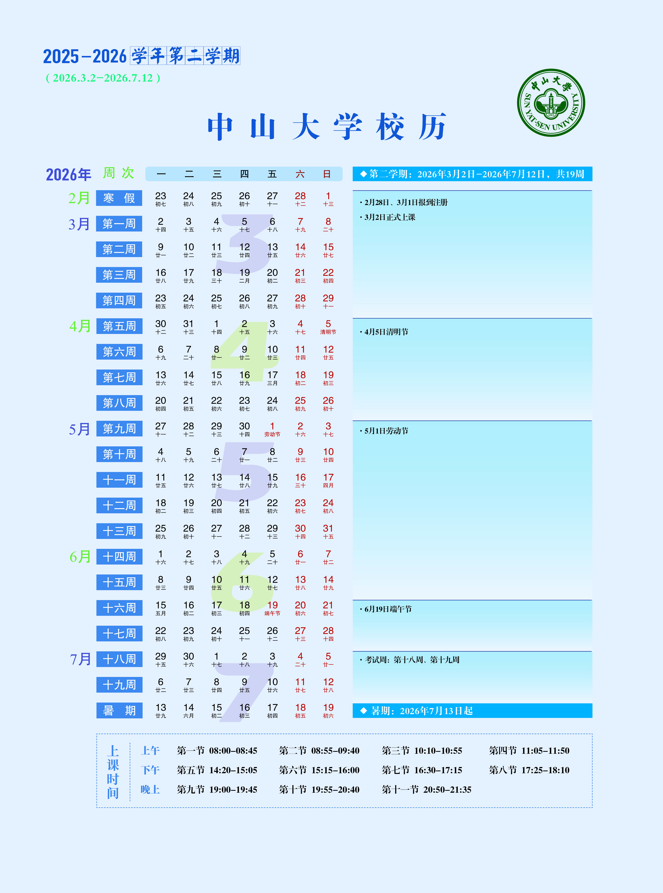

# The first year of my study
> Notice: This passage will publish at [github](https://github.com/miaozxm/plan/blob/main/TheFirstYear/TheFirstYear.md), you can click the link to see it easily if your webserver is good.
## Abstract(2025.9.14)
>From now to the end of this study year. There are 10 months for me to get ready to start my research.

>I will make plans for every season, every month, every week and every day. I will.

>Ok, with no more words, I will make a plan for this year.

This year, I need finish all of my courses, and get a stable base for my future research.

1. Finish all of my courses.
2. Familiar with my research topic.
    1. Follow the senior LiYi.
    2. Familarize with the tools of the research. And arrange the deadline of every item.
3. Read the most advancing papers every week and exchange with my tutor and seniors.

Up to now, I realised that the time arrange may be too strict. I need plan flexible enough. So I can make the upper limit and lower limit.

Such as:
* 1 month: 
    * Expectation: 
        * 3 articles to be read carefully
        * 6 articles to be read roughly
    * Upper limit:
        * 5 articles to be read carefully
        * 8 articles to be read roughly
    * Low limit:
        * 2 article to be read carefully
        * 4 articles to be read roughly

Oh, I may list a list:
| Items | Expectation | Upper limit | Low limit |
| --- | --- | --- | --- |
|Carefully read articles|3|5|2|
|Roughly read articles|6|8|4|
|Total articles|9|13|6|

Sum it up, this text is to be help me to arrange the life of my first year of study. More details will be written in the month plan and the week plan.

Latter, I will set the hyperlink to the month plan and the week plan here.

A year can be divided into 4 parts. These are auttum semester, spring semester and two vocations.

Accorroding to the academic calendar as image below, the first part is from 2025-09-8 to 2026-01-18, and then the first long vocation will come. The part composed of 19 weeks, and now leaves 18 weeks for me.

So I divide these time into 3 sections, 1 section for 5 weeks, remaining 3 weeeks for flexibility, for preparation, summary, and review purposes.

Each section consists of 5 weeks, with the first four weeks used to complete most of the planning, and the last week used for review, closing, and planning for the next section

* The first section is from 9/15 to 10/19.
* The second section is from 10/20 to 11/23.
* The third section is from 11/24 to 12/28.
* And the ending of the first part is from 12/29 to 1/18.

As same, I can list a list for the schedule.
|section|start|end|
|-|-|-|
|1|9/15|10/19|
|2|10/20|11/23|
|3|11/24|12/28|
|ending|12/29|1/18|

## Aim
**Publish Paper in a/~~THE~~ Good/~~BEST~~ Journal**

### Sub aim
- [ ] Reproduce senior's works and know the principles of the works.
- [ ] Produce a great idea.
- [ ] Write a review about the topic and the idea.
- [ ] Test the possibility of the idea.
- [ ] Let the idea come true.
- [ ] Write the paper.

So I can pack the sub aims into different parts. Sure, it must be follow the time evolution. There are some note as follow.

- The first part of this year is from 9/15 to 1/18. I will finish the first three subaims in this part.
- And the first two subaim should be carried out simultaneously in the first two parts.
- And more details will be written in the [the first section plan (click me to open)](TheFirstPart\The1stPartOf1stYear.md)(en...It seems like strike. You can click the path left to open it by your cute hand.)

Those are arrangements about the first part of my postgraduate study.

